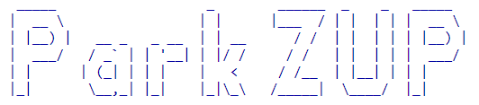
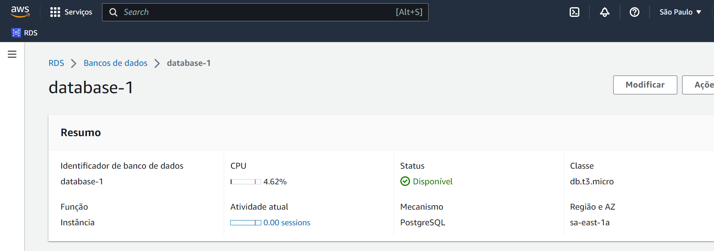
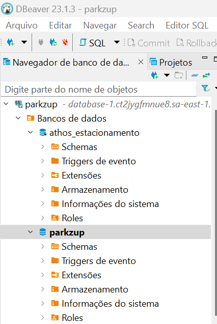
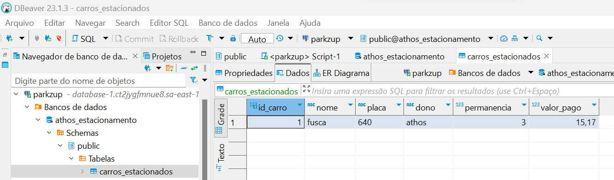
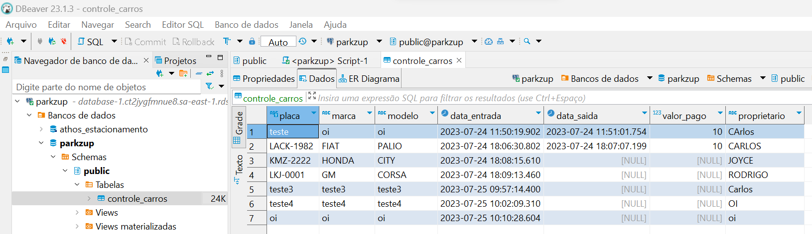

## Projeto "Gestão de Estacionamento - Park ZUP"

### Introdução

Este repositório contém o código-fonte de um projeto de Gerenciador de Estacionamento desenvolvido em Java. 

O objetivo do projeto é criar uma aplicação para gerenciar a entrada, permanência e saída de carros em um estacionamento.

### Funcionamento

#### Opção 1 - Adicionar carro no estacionamento

- Descrição: Esta opção permite que o usuário adicione um novo carro ao estacionamento.

- Funcionamento:
    1. O usuário é solicitado a fornecer as informações do carro, como placa, marca, modelo e nome do proprietário.
    2. Um objeto do tipo "Carros" é criado com as informações fornecidas.
    3. A data e hora de entrada são registradas automaticamente como o momento em que o carro é adicionado.
    4. O objeto do carro é adicionado ao banco de dados do estacionamento.

#### Opção 2 - Registrar saída e Calcular Valor do estacionamento

- Descrição: Esta opção permite que o usuário registre a saída de um carro estacionado e calcule o valor a ser pago com base no tempo de permanência.

- Funcionamento:
    1. O usuário visualiza uma lista dos carros atualmente estacionados.
    2. É solicitado ao usuário que insira a placa do carro que está saindo.
    3. O sistema busca o carro correspondente no banco de dados.
    4. A data e hora de saída são registradas automaticamente como o momento em que a opção é selecionada.
    5. O sistema calcula o tempo de permanência do carro no estacionamento.
    6. Com base no tempo de permanência, o valor a ser pago é calculado conforme a tabela de tarifas.
    7. O valor a ser pago é exibido na tela.

#### Opção 3 - Listar todos os carros em estacionamento

- Descrição: Esta opção permite que o usuário visualize uma lista dos carros atualmente estacionados no estacionamento.

- Funcionamento:
    1. O sistema busca no banco de dados todos os carros que ainda não registraram saída (ou seja, ainda estão estacionados).
    2. Os detalhes de cada carro são exibidos na tela.

#### Opção 4 - Listagem Geral dos carros

- Descrição: Esta opção permite que o usuário visualize uma listagem geral de todos os carros que já passaram pelo estacionamento, incluindo os que já saíram.

- Funcionamento:
    1. O sistema busca no banco de dados todos os carros, independentemente de já terem saído ou não.
    2. Os detalhes de cada carro são exibidos na tela.

#### Banco de Dados - Documentação

O projeto utiliza um banco de dados PostgreSQL hospedado no Amazon RDS para armazenar as informações dos carros estacionados. 

Definição da estrutura pelo grupo:
Carlos Laczynski, Athos Caetano, João Vitor e Francisco Silva.

A estrutura base da tabela de controle dos carros é a seguinte abaixo.
Podendo que algumas propriedades, características das variáveis e tipos de dados sofram mudanças de acordo com o código de cada desenvolvedor.

| Nome da coluna | Tipo de dados |
|----------------|---------------|
| placa          | varchar(20)   |
| marca          | varchar(50)   |
| modelo         | varchar(50)   |
| data_entrada   | timestamp     |
| data_saida     | timestamp     |
| valor_pago     | float8        |
| proprietario   | varchar(100)  |

#### Conclusão

O projeto "Gestão de Estacionamento" é uma aplicação em Java que oferece funcionalidades para gerenciar a entrada, permanência e saída de carros em um estacionamento. 

Utilizando um banco de dados PostgreSQL hospedado no Amazon RDS e gerenciado através do DBeaver, o projeto garante a persistência e o acesso seguro aos dados dos carros estacionados. 

Com a aplicação, é possível registrar novos carros, calcular o valor a ser pago pelos clientes e visualizar a lista de carros atualmente estacionados ou que já passaram pelo estacionamento. 

O uso da nuvem da AWS e da ferramenta DBeaver contribui para uma gestão eficiente do estacionamento, proporcionando uma experiência mais prática e confiável tanto para o proprietário quanto para os clientes.

#### Observações

Abaixo segue print do Painel RDS da AWS definido pelo grupo.

Legenda: Acima um print da tela da AWS RDS com o banco de dados database-1, com o resumo das configurações.

   
Legenda: Mostrando a tela de pastas com os banco de dados athos_estacionamento e suas tabelas. O banco de dados parkzup e suas tabelas. Ambos bancos de dados, feitos pelo Athos e Carlos Laczynski.

   
Legenda: Print da tela da tabela athos_estacionamento,com o seu primeiro registro Fusca.

   
Legenda: Print da tela da tabela parkzup com os registros inseridos no banco de dados.

#### FIM ####