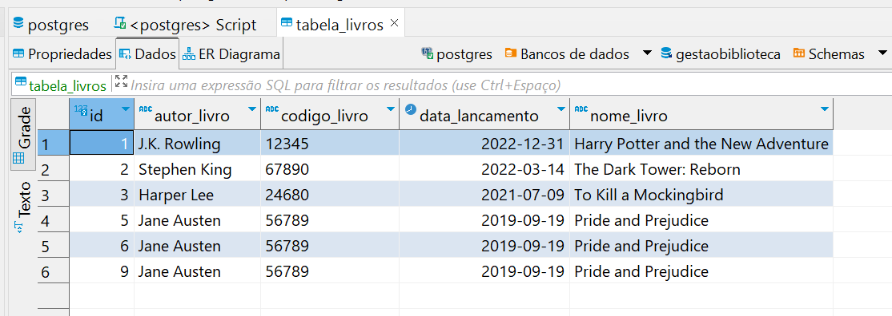
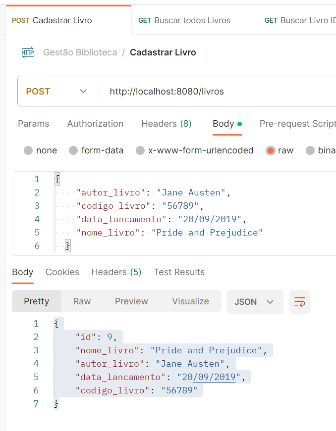
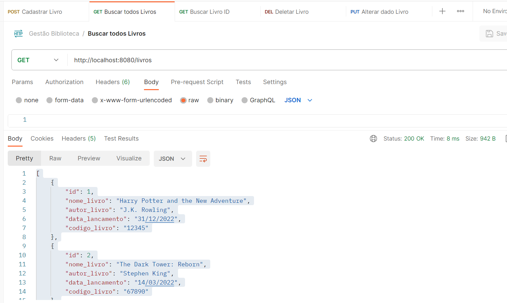
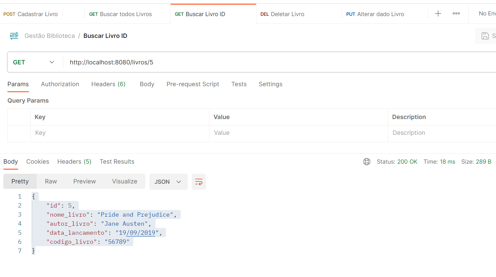
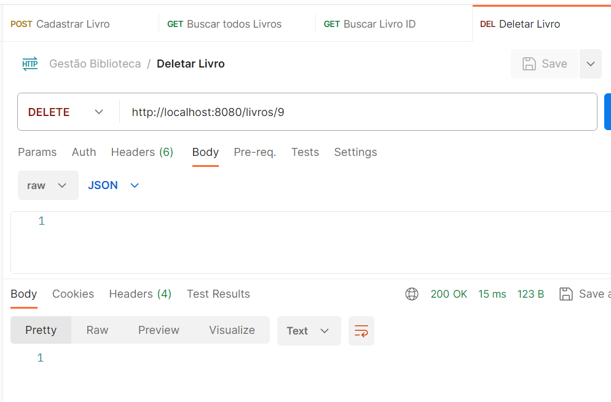
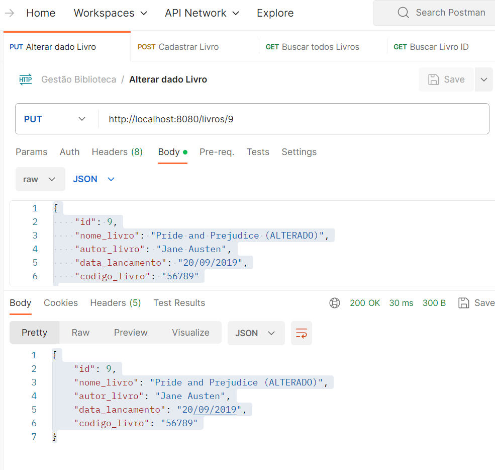

## Exercícios de Gestão de Biblioteca

Este é um aplicativo de gerenciamento de uma biblioteca desenvolvido com Spring Boot. 
O objetivo é permitir que os usuários visualizem, cadastrem, atualizem e excluam informações sobre livros na biblioteca via POSTMAN.

## Funcionalidades

O aplicativo oferece as seguintes funcionalidades:

1. **Exibir todos os livros:** Permite visualizar uma lista de todos os livros cadastrados na biblioteca, mostrando seus detalhes, como nome, autor, data de lançamento e código do livro.

2. **Exibir um livro específico:** Permite visualizar informações detalhadas de um livro específico, identificado pelo seu ID.

3. **Cadastro de um novo livro:** Permite cadastrar um novo livro na biblioteca fornecendo os detalhes necessários, incluindo nome, autor, data de lançamento e código do livro.

4. **Alteração de um livro:** Permite atualizar as informações de um livro existente na biblioteca, como nome, autor, data de lançamento e código do livro.

5. **Excluir um livro:** Permite excluir um livro da biblioteca com base no seu ID.

## Modelo de Dados

O aplicativo utiliza a seguinte estrutura para o modelo de dados do livro:

```java
public class LivrosModel {

    @Id
    @GeneratedValue(strategy = GenerationType.IDENTITY)
    private Long id;

    @Column(length = 255, nullable = false)
    private String nome_livro;

    @Column(length = 255, nullable = false)
    private String autor_livro;

    @Column(length = 10, nullable = false)
    @JsonFormat(pattern = "dd/MM/yyyy")
    private Date data_lancamento;

    @Column(length = 50, nullable = false)
    private String codigo_livro;
}
```

## Endpoints da API

O aplicativo disponibiliza a seguinte API REST com os seguintes endpoints:

1. **GET /livros**: Retorna uma lista de todos os livros cadastrados na biblioteca.

2. **GET /livros/{id}**: Retorna as informações detalhadas de um livro específico, com base no seu ID.

3. **POST /livros**: Cadastra um novo livro na biblioteca com os dados fornecidos no corpo da requisição.

4. **PUT /livros/{id}**: Atualiza as informações de um livro existente na biblioteca, identificado pelo seu ID.

5. **DELETE /livros/{id}**: Exclui um livro da biblioteca com base no seu ID.

## Tecnologias Utilizadas

O aplicativo foi desenvolvido utilizando as seguintes tecnologias:

- Java 11
- Spring Boot
- PostgreSQL - Dbeaver (banco de dados)
- Maven (gerenciamento de dependências)
- IDE de desenvolvimento - IntelliJ

## Instruções de Uso

Para executar o aplicativo, siga as seguintes etapas:

1. Certifique-se de ter o Java instalado em seu sistema.

2. Configure o PostgreSQL e crie um banco de dados chamado "gestaobiblioteca". As configurações de conexão com o banco de dados devem ser definidas no arquivo `application.properties` ou `application.yml`.

3. Clone ou baixe o projeto do aplicativo para o seu ambiente de desenvolvimento.

4. Abra o projeto em sua IDE de desenvolvimento e aguarde as dependências serem baixadas pelo Maven.

5. Inicie a aplicação executando a classe `BibliotecaSpringApplication`.

6. Acesse a API REST nos endpoints mencionados acima usando uma ferramenta como Postman ou através de um navegador.

## Considerações Finais

Este aplicativo de gestão de biblioteca é uma versão básica e pode ser estendido com mais funcionalidades, autenticação de usuários e outras melhorias de acordo com as necessidades específicas. 
Certifique-se de tomar as medidas adequadas para garantir a segurança do aplicativo e do banco de dados, especialmente se for implantado em um ambiente de produção.


## Captura de tela




















