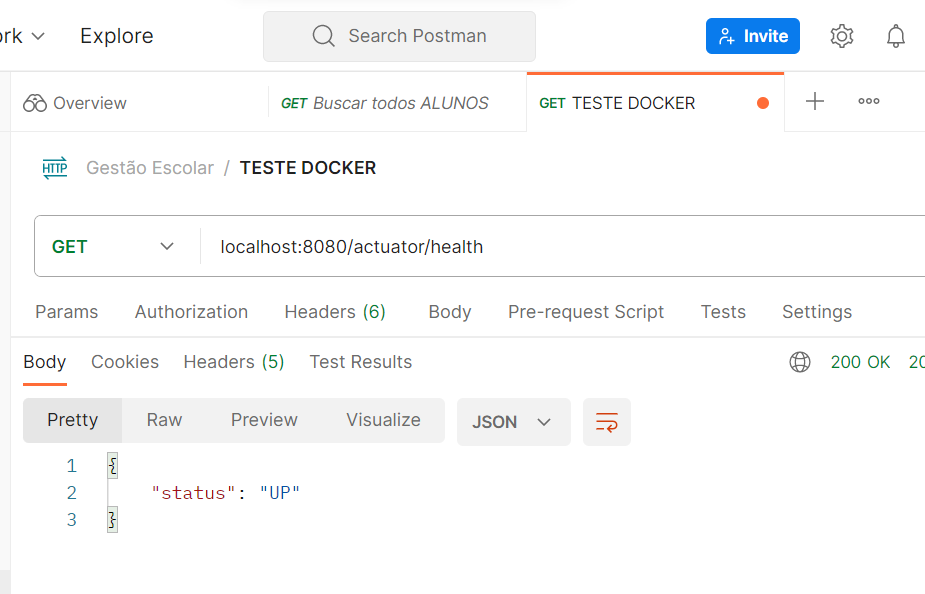
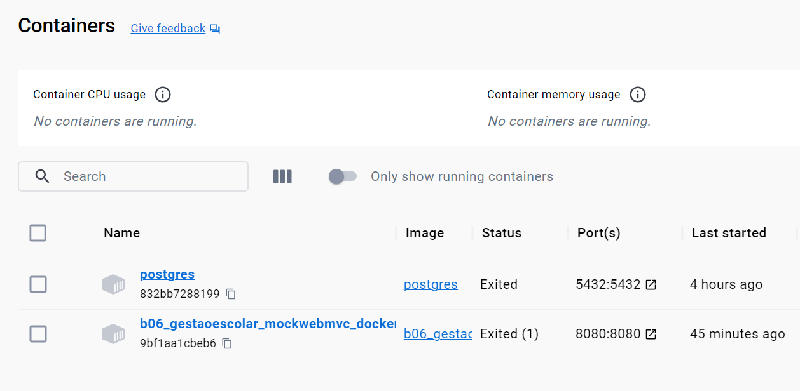
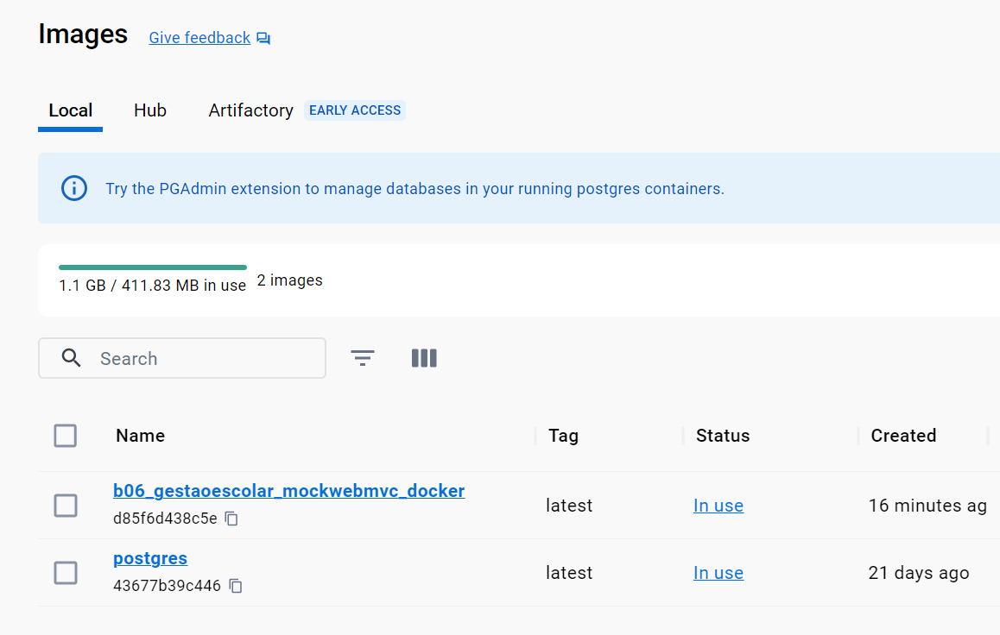
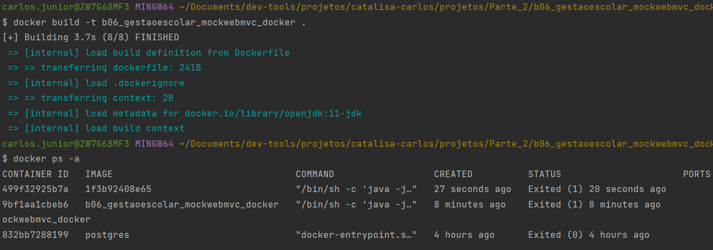

# Documentação: Dockerfile para Containerizar um Projeto Spring Boot com PostgreSQL

## Resumo
Este repositório contém um Dockerfile que usado para containerizar um projeto anterior de Gestão Escolar utilizando Spring Boot com PostgreSQL. 

Segue [repositório do projeto: ](https://github.com/carloslaczynskizup/ProjetoZero/tree/main/projetos/Parte_2/b03_GestaoEscolar_MockWebMVC)

Ele utiliza a imagem base do OpenJDK 11 e configura o ambiente para executar a aplicação Spring Boot em um container Docker. 
As instruções a seguir explicam cada comando no arquivo Dockerfile.

## Dockerfile
```Dockerfile
# Use a imagem base do OpenJDK 11
FROM openjdk:11-jdk

# Mantenedor do Dockerfile
MAINTAINER carloslack

# Defina uma variável de ambiente para o nome da aplicação
ENV APP_NAME b06_gestaoescolar_mockwebmvc_docker

# Copie o arquivo JAR da aplicação para o contêiner
COPY ./target/${APP_NAME}.jar /app/${APP_NAME}.jar

# Defina o diretório de trabalho dentro do contêiner
WORKDIR /app

# Comando para executar a aplicação Spring Boot
CMD java -jar ${APP_NAME}.jar

# Exponha a porta 8080
EXPOSE 8080
```

### Comandos Explicados
- **FROM**: Especifica a imagem base a ser usada para construir o container. Neste caso, estamos usando a imagem base do OpenJDK 11.

- **MAINTAINER**: Define o mantenedor do Dockerfile.

- **ENV**: Define variáveis de ambiente no container. No exemplo, a variável `APP_NAME` recebe o nome do projeto.

- **COPY**: Copia o arquivo JAR da aplicação para dentro do container, na pasta `/app`.

- **WORKDIR**: Define o diretório de trabalho dentro do container. Todos os comandos subsequentes serão executados neste diretório.

- **CMD**: Especifica o comando a ser executado quando o container for iniciado. Neste caso, o comando `java -jar ${APP_NAME}.jar` inicia a aplicação Spring Boot.

- **EXPOSE**: Informa as portas em que a aplicação dentro do container está ouvindo. No exemplo, a porta 8080 é exposta.

## Construção e Execução do Container
Para construir e executar o container, siga os passos abaixo:

1. Certifique-se de que o Docker esteja instalado em seu sistema.

2. No terminal, navegue até a pasta raiz do seu projeto Spring Boot, onde o Dockerfile está localizado.

3. Execute o seguinte comando para construir a imagem Docker (substitua "nome-da-imagem" pelo nome desejado):
   ```bash
   docker build -t nome-da-imagem .
   ```

4. Após a construção da imagem, execute o seguinte comando para criar e iniciar o contêiner (substitua "nome-do-container" pelo nome desejado):
   ```bash
   docker run -d --name nome-do-container -p 8080:8080 nome-da-imagem
   ```

5. Verifique se o contêiner está em execução:
   ```bash
   docker ps
   ```

## Verificação da Aplicação
Você pode verificar se a aplicação Spring Boot está funcionando acessando `http://localhost:8080` em seu navegador ou usando ferramentas como Insomnia ou Postman.

Lembre-se de que você adicionou a dependência Spring Boot Actuator para verificar a comunicação com a aplicação. Faça uma requisição GET para `localhost:8080/actuator/health`.

1. É preciso das seguintes aplicações e dependências instaladas em sua máquina:

2. Docker: O Docker é essencial para criar e executar containeres. Certifique-se de ter o Docker instalado em sua máquina. Você pode seguir as instruções de instalação para o seu sistema operacional em Docker Install.

3. Maven: Se você estiver desenvolvendo o projeto Spring Boot localmente e planeja criar o arquivo JAR antes de containerizá-lo, você precisará do Maven. Você pode instalar o Maven seguindo as instruções em Apache Maven.

4. Java Development Kit (JDK): Para desenvolver e compilar o projeto Spring Boot, você precisa do JDK instalado em sua máquina. Certifique-se de ter o JDK 11 ou superior instalado. Você pode verificar a versão do JDK usando o comando java -version.

5. IDE (Opcional): Você pode usar uma IDE, como o IntelliJ IDEA ou o Eclipse, para desenvolver seu projeto Spring Boot. É útil, mas não é estritamente necessário para a execução do aplicativo no Docker.

    
Obs.: Certifique-se de que todas essas dependências estejam instaladas e funcionando corretamente em sua máquina antes de criar e executar o container Docker com o aplicativo Spring Boot.

Para mais informações, consulte a [fonte bibliográfica](https://www.linkedin.com/pulse/utilizando-o-docker-em-seus-projetos-spring-boot-da-rosa/?originalSubdomain=pt) que me ajudou a entender um pouco sobre o assunto e para obter detalhes adicionais sobre o uso do Docker em projetos Spring Boot.

## Prints das respostas da APP

### Resposta pelo Postman depois da implementação do Container Docker:



### Container criado (Visualização pelo Docker Desktop)



### Images criada (Visualização pelo Docker Desktop)



### Console da IDE IntelliJ



