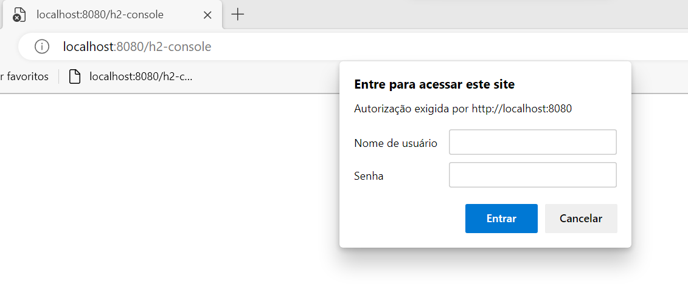

# ApiDeVendasSpring
Desafio do módulo, fazer uma api de um Crud de produtos, colocando algumas validações, tratando alguns dos erros mais comuns na hora de fazer as requisições.

Como eu consegui fazer isso, decidi evoluir um pouco mais o desafio, simulei uma api de vendas, onde agora o Crud ta concentrado em clientes e produtos.

Acrescentando mais duas classes categoria e pedidos, sendo esta responsaveis apenas pela listagem.

Toda a inserção de dados está na classe TestConfig.

Possui todos os relacionamentos de tabelas existententes com @OneToOne,OneToMany,@ManyToOne,@ManyToMany e @Embeddable e @EmbbedableId, pra criar uma tabela
de pedido com produto, sendo ambas chaves composta de uma tabela associativa que o jpa faz.

E não menos importante, todas as camadas, repository, service e controller, possuem 100% de corbertura de testes.

Foi muito divertido esse desafio ^^.

NOTA: Para acessar a doc da api, basta copiar o que está dentro do apivendas.yaml e colar no editor de texto do Swagger Editor.
link de ref: https://editor.swagger.io/

# Implementação Security

Este é um projeto de um outro colega do link:

https://github.com/mumuryllo/ApiDeVendasSpring

Os requisitos dos exercícios para implementação de Security foram:

    - Requisitos:
    1. Conter pelo menos 2 roles para a aplicação;
    2. Conter criptografia de senha;
    3. Conter um controller para criar, visualizar e deletar novos usuários.

Porém, eu só consegui colocar segurança em uma primeira camada, de acordo com a classe WebSecurityConfiguration
que é ao acessar o site: http://localhost:8080/h2-console conforme figura abaixo.

Os 3 requisitos supracitados não foram implementados ainda por falta de conhecimento.

###### FIM
